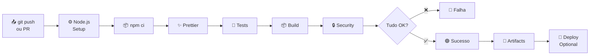

# 📚 Documentação da Pipeline CI/CD - EmpreendeSC

> Pipeline de Integração Contínua e Deploy Contínuo para o projeto EmpreendeSC

## ⚡ Comece Aqui

[👉 **Sou novo, por onde começo?**](./GETTING_STARTED.md)

---

## 📂 Estrutura de Documentação

```
.github/
├── workflows/                    # 🔧 Configurações executadas pelo GitHub
│   ├── ci.yml                   # Pipeline de CI (testes, build, lint)
│   └── deploy.yml               # Pipeline de Deploy (opcional)
│
├── 📖 Documentação
│   ├── INDEX.md                 # ← Este arquivo
│   ├── GETTING_STARTED.md       # Guia passo a passo para devs
│   ├── FLOW_DIAGRAM.md          # Diagrama visual do fluxo
│   ├── CI_PIPELINE.md           # Documentação técnica detalhada
│   ├── GITHUB_SECRETS.md        # Como configurar secrets
│   ├── TROUBLESHOOTING.md       # Resolvendo problemas
│   ├── FILES.md                 # Lista de arquivos criados
│   ├── README_BADGE.md          # Badges para seu README
│   └── INDEX.md                 # ← Este arquivo
│
├── Configurações
│   ├── .prettierrc.json         # Regras de formatação de código
│   └── .prettierignore          # Pastas que Prettier ignora
│
└── 📝 Root Files (modificados)
    └── package.json             # Scripts prettier:check e prettier:fix adicionados
```

---

## 🎯 Guia Rápido por Perfil

### 👨‍💻 Sou Desenvolvedor

Você precisa saber como trabalhar com a pipeline abrindo um PR:

1. [GETTING_STARTED.md](./GETTING_STARTED.md) - Leia primeiro
2. [TROUBLESHOOTING.md](./TROUBLESHOOTING.md) - Se algo der errado
3. [FLOW_DIAGRAM.md](./FLOW_DIAGRAM.md) - Para entender o fluxo visual

### 👨‍🏫 Sou Tech Lead / Arquiteto

Você precisa entender toda a configuração:

1. [CI_PIPELINE.md](./CI_PIPELINE.md) - Documentação técnica completa
2. [FLOW_DIAGRAM.md](./FLOW_DIAGRAM.md) - Fluxo geral
3. [ci.yml](./workflows/ci.yml) - Arquivo de configuração
4. [deploy.yml](./workflows/deploy.yml) - Configuração de deploy

### 🚀 Vou fazer Deploy

Você precisa configurar os secrets:

1. [GITHUB_SECRETS.md](./GITHUB_SECRETS.md) - Guia completo de secrets
2. [deploy.yml](./workflows/deploy.yml) - Ativar sections relevantes
3. [CI_PIPELINE.md](./CI_PIPELINE.md) - Melhorias futuras

---

## 📋 O Que a Pipeline Faz

Quando você faz um commit na `main` ou `develop`, ou abre um Pull Request:



**Tempo total:** ~1-2 minutos

---

## 🔍 Checklist Pré-Push (Recomendado)

Execute estes comandos **antes** de fazer push para evitar falhas:

```bash
# 1. Formatar código
npm run prettier:fix

# 2. Rodar testes
npm test -- --run

# 3. Fazer build
npm run build

# 4. Verificar segurança
npm audit --audit-level=moderate
```

✅ Se tudo passar, você pode fazer push!

---

## 📊 Status da Pipeline

Badge para seu README:

```markdown
[](https://github.com/seu-usuario/empreende-sc-frontend/actions)
```

[Veja exemplos de badges →](./README_BADGE.md)

---

## ❓ FAQ Rápido

**P: Onde vejo os logs da pipeline?**
R: GitHub → Actions → Selecione a execução → Clique em "Details"

**P: A pipeline está falhando. O que fazer?**
R: Veja [TROUBLESHOOTING.md](./TROUBLESHOOTING.md)

**P: Como ativar deploy automático?**
R: Siga [GITHUB_SECRETS.md](./GITHUB_SECRETS.md)

**P: Quanto tempo leva?**
R: ~1-2 minutos em média

**P: Preciso fazer algo local?**
R: Sim! Execute os comandos em [Checklist Pré-Push](#-checklist-pré-push-recomendado) antes de push

---

## 🚀 Próximos Passos

### 1️⃣ Imediato
- [x] Arquivos criados
- [ ] Commit e push dos arquivos
- [ ] Acompanhar primeira execução em GitHub Actions

### 2️⃣ Curto prazo
- [ ] Testar abrindo um Pull Request
- [ ] Verificar artifacts gerados
- [ ] Adicionar badge ao README.md

### 3️⃣ Médio prazo (Opcional)
- [ ] Configurar deploy automático
- [ ] Definir regras de proteção de branch
- [ ] Configurar notificações Slack

---

## 📚 Documentos Disponíveis

| Documento | Tipo | Para Quem | Link |
|-----------|------|----------|------|
| **GETTING_STARTED** | 📖 Guia | Devs novos | [→](./GETTING_STARTED.md) |
| **FLOW_DIAGRAM** | 📊 Visual | Todos | [→](./FLOW_DIAGRAM.md) |
| **CI_PIPELINE** | 🔧 Técnico | Arquitetos | [→](./CI_PIPELINE.md) |
| **GITHUB_SECRETS** | 🔐 Segurança | Tech Leads | [→](./GITHUB_SECRETS.md) |
| **TROUBLESHOOTING** | 🐛 Help | Quando falha | [→](./TROUBLESHOOTING.md) |
| **FILES** | 📁 Referência | Documentação | [→](./FILES.md) |
| **README_BADGE** | 🎨 Marketing | README.md | [→](./README_BADGE.md) |

---

## 🔗 Links Úteis

- [GitHub Actions Documentation](https://docs.github.com/en/actions)
- [Angular Build Guide](https://angular.io/cli/build)
- [Prettier Code Formatter](https://prettier.io/)
- [Vitest Unit Testing](https://vitest.dev/)

---

## 💬 Suporte

Se tiver dúvidas:

1. Verifique [TROUBLESHOOTING.md](./TROUBLESHOOTING.md)
2. Leia a documentação do seu serviço (GitHub, Angular, etc)
3. Abra uma issue no repositório

---

**Última atualização:** 11 de Março de 2026  
**Projeto:** EmpreendeSC  
**Versão:** 1.0  
**Status:** ✅ Pronto para uso
